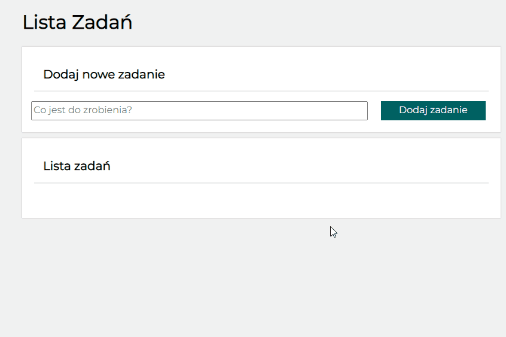

# To do list

## Description
The project was intended to create an input area where You can write things 'to do' and make a list displayed below. On the list You can mark if action is already done or delete it completely from list.

## you can check it out here:
 https://github.com/Gosia-Magdzik/to-do-list/settings/pages

## Technologies I have used:
-   HTML
-   CSS
-   JavaScript
-   BEM
-   Grid

 # short presentation: 

